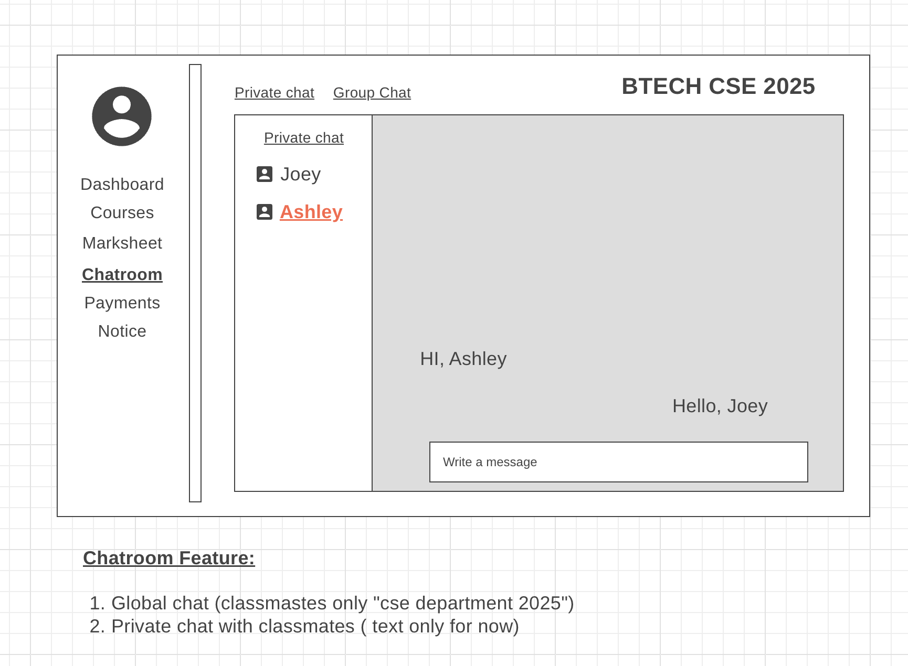

# Student Dashboard Chatroom Feature — Product Case Study

A product case study focused on designing, validating, and measuring a native, in-dashboard peer-to-peer communication feature for students.

---

## Overview

Students frequently rely on external tools such as WhatsApp, LinkedIn, and Telegram to communicate with peers about coursework. While familiar, these tools operate outside the learning environment, leading to fragmented discussions, loss of academic context, and reduced engagement within the platform.

This case study explores the discovery, design, and validation of a **native Chatroom feature** embedded directly within a student dashboard to enable contextual, classroom-based communication.

**Objective:**  
Enable seamless, contextual peer collaboration within the learning platform while reducing dependency on external messaging tools.

---

## Product Mockup

---

## Problem Statement

Students do not have access to an integrated peer-to-peer communication feature within the learning dashboard, forcing them to rely on external messaging platforms such as WhatsApp, LinkedIn, and Telegram. This results in fragmented discussions, diminished engagement in the academic context, and reduced visibility into peer collaboration on the platform.

---

## Product Hypothesis

If a dedicated Chatroom feature is introduced within the student dashboard—offering a familiar, classroom-scoped messaging experience that supports both group and private peer communication—then students will adopt it as their primary channel for academic interaction. This will reduce reliance on external platforms and increase overall in-platform engagement.

This hypothesis is grounded in the belief that familiar UI patterns, immediate access, and classroom-contextual communication encourage adoption.

---

## Goals & Success Metrics

Feature success is measured using clear, instrumentable metrics:

- **Feature Adoption**  
  `(Weekly Active Chat Users ÷ Weekly Active Students) × 100`

- **Feature Retention**  
  `(Chat users active in Month N ∩ Month N+1 ÷ Chat users active in Month N) × 100`

- **Peer-to-Peer Engagement**  
  `(Students sending ≥ N messages per week ÷ Weekly Active Students)`

- **Chat Participation Rate**  
  `(Students who sent ≥1 message ÷ Total enrolled students)`

- **Message Volume**  
  `(Total messages sent ÷ Active classrooms per day)`

- **Student Satisfaction**  
  `(Positive chat feedback responses ÷ Total chat feedback responses)`

- **Session Duration Lift**  
  `((Avg session duration for chat users − Avg session duration for non-chat users) ÷ Avg session duration for non-chat users)`

---

## Validation Plan

To validate the hypothesis, the feature is launched as a **Minimum Viable Product (MVP)** with a controlled rollout.

- **MVP Rollout**  
  Release the Chatroom feature to a limited set of classrooms

- **Measurement Window**  
  Track adoption, engagement, and retention over 30, 60, and 90 days

- **Experiment Design**  
  Compare chat-enabled classrooms against non-chat classrooms on adoption, engagement, session duration, and retention metrics

- **Decision Criteria**  
  Scale or iterate the feature platform-wide if predefined success thresholds are met

---

## Feature Scope (MVP)

### 1. Classroom Group Chat (Default View)
- Automatically created for each class
- All enrolled students are added by default
- No setup or joining links required
- Conversations remain tied to classroom context

### 2. Member List Panel
- Displays all enrolled classmates
- Enables peer discovery and visibility
- One-click access to private chats

### 3. Private One-to-One Chat
- Scoped strictly to classroom members
- Enables focused peer collaboration
- Keeps academic conversations within the platform

### 4. Familiar Messaging Interface
- WhatsApp-like UI patterns
- Text-first experience
- Minimal learning curve to encourage adoption

---

## Vision Narrative

A student logs into the dashboard to continue their coursework and encounters a concept they do not fully understand. Previously, this would mean switching to WhatsApp, scrolling through unrelated messages, and hoping someone responds.

Instead, the student opens the **Chatroom tab** directly within the dashboard and enters a familiar, classroom-specific group chat. Confident that everyone shares the same academic context, they post their question. Within minutes, peers respond with explanations and insights.

For deeper clarification, the student seamlessly switches to a private one-to-one chat without leaving the platform. Over time, the Chatroom becomes the default space for asking questions, coordinating study sessions, and collaborating with peers—without the distraction of external tools.

From the platform’s perspective, discussions that once happened externally are now visible, contextual, and measurable, leading to higher engagement and stronger peer connections.

---

## Key Product Decisions & Trade-offs

- **Classroom-Based Chat vs Global Chat**  
  Chose classroom-scoped communication to preserve relevance and reduce noise

- **Private Messaging Limited to Classmates**  
  Prevents misuse and maintains academic focus

- **Text-First MVP vs Rich Media**  
  Prioritized simplicity, speed, and scalability over feature richness

---

## Risks & Mitigations

- **Low Adoption Due to Habitual Use of External Apps**  
  → Make Chatroom the default entry point from courses and lessons

- **Off-Topic or Low-Quality Conversations**  
  → Clear usage guidelines, lightweight moderation tools, instructor visibility

- **Knowledge Fragmentation via Private Chats**  
  → Encourage group discussions and highlight unresolved questions

- **Performance & Scalability Risks**  
  → Text-first MVP, pagination, incremental infrastructure scaling

- **Privacy & Misuse Concerns**  
  → Classroom-only access, blocking/reporting options, audit logs

